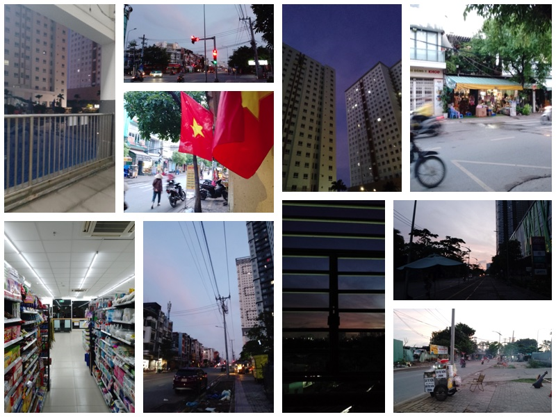
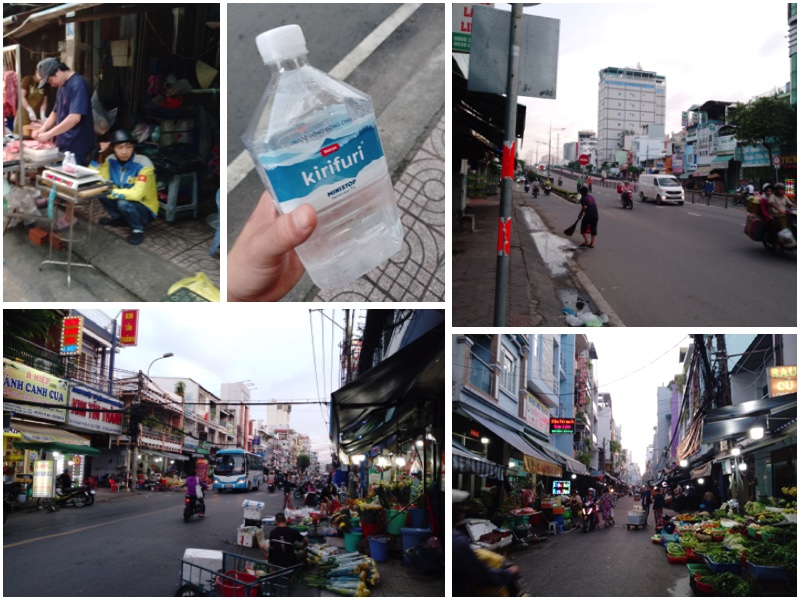
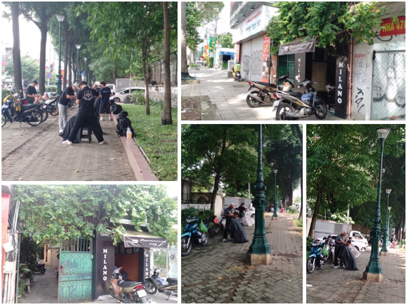
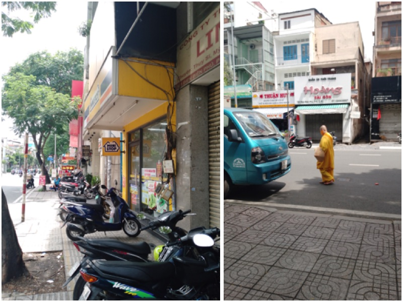
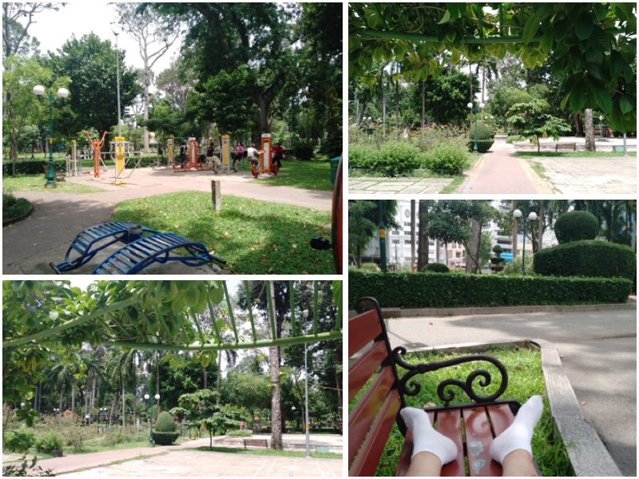
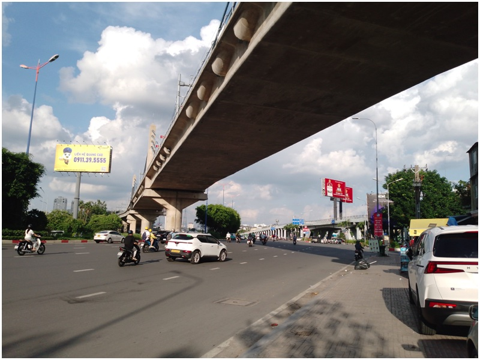

## Beyond The Trivial
> We need sometimes to escape into open solitudes, into aimlessness, into the moral holiday of running some pure hazard, in order to sharpen the edge of life, to taste hardship, and to be compelled to work desperately for a moment no matter what.

\- George Santayana, “The Philosophy of Travel”

> I went to the woods because I wished to live deliberately, to front only the essential facts of life, and see if I could not learn what it had to teach, and not, when I came to die, discover that I had not lived.

\- Henry David Thoreau, Walden

> You should view each new travel frustration—sickness, fear, loneliness, boredom, conflict—as just another curious facet in the vagabonding adventure.

\- Rolf Potts, "Vagabonding"

> “Two years he walks the Earth. No phone, no pool, no pets, no cigarettes. Ultimate freedom. An extremist. An aesthetic voyager whose home is the road. Escaped from Atlanta. Thou shalt not return, 'cause "the West is the best." And now after two rambling years comes the final and greatest adventure. The climactic battle to kill the false being within and victoriously conclude the spiritual revolution. Ten days and nights of freight trains and hitchhiking bring him to the great white north. No longer to be poisoned by civilization he flees, and walks alone upon the land to become lost in the wild.”

\- Alexander Supertramp, Alaska, 1992

In the last days of my trip to my home city, I've decided that I must see the city not as just a place to enjoy ,to have nice meals and drink, but to review the city as the place I've been growing up in. Having walked around alot since I've move to another country, I thought that the best way for me to see the city is to slowly walk through it, to see the lives and the places with deeper eyes.

This is my adventure in Sai Gon. Below are the thoughts I had as I walked, and the scenes I saw as I think about them. I have kept these thoughts unedited just as they are in my head as I think about them, and because of this, some thoughts are not as clear as others (and yes, cursing happened). Thoughts are not the only thing that appears in my head while I walked, but songs came up alot as well. I've also written down the songs that came up at that moment, and those sections simply called "song".

I don't know if this is beneficial or interesting for others to read, but I try to be transparent and authentic as possible to perhaps inspire others to travel the same way I did. I believe that this was one or if not the most memorable journey I've been through in my trip to Viet Nam.

## Just A Normal Day?

### 0500: Home, Ministop

- bought a bottle of water
- tiktok scrolling guards
- overnight workers in ministop who works for their college money, whilst I didn't have to
- cao lỗ lights off, sun on
- new chains and watch is a symbol for a new life chapter
- why am I putting myself in this journey? For myself or for other people's approval?
- morning food stalls: fuel for other people's day
- i walked pass district 8's places, I remember my origins. A gritty kid from Phu Yen to a gritty part of the city to abroad in europe. These places built me into the person i am rn.
- dead mouse. What if that was me.
- song: i don't know who's gonna kiss you when I'm gone. So I'm gonna love you now. Like it's all I have

### 0547: Nguyen Thi Tan market

- even me drinking this water is consuming from nature, exploiting other people's work and taking advantages of them. I'm grateful for this bottle of water
- didn't plan this market in the route. Gg maps spontaneous suggestions can be good
- what if that dead mouse's death is better than human' sufferings?
- old man cleaning street trash. This is his job or love? -> job (owner of the store behind trash). Cleaning trash = boss?

### 0600: Nguyen Van Cu bridge, Nguyen Van Linh road

- cross bridge without sidewalks. Gg maps fucks.
- yes! A sidewalk!
- can already notice the sore in legs when I'm only in the first hour. Banh mi now maybe?
- is this a shitty version of forrest gump?
- i chose peaceful before. Is this person sleeping on the bridge in their peace?
- ahh ants!!
- smiled and nodded at a stranger. Daily dose of social anxiety baby!
- bikers. Alot of morning bikers.
- good path. No more ants.
- song: i miss your love, i miss your touch. When everything's wrong, you make it right
- songs came into your head after a word or sentences of that song popped up first
- fahasa's office is here. Neat.
- a melody popped up in my head, and its lyrics go like: i just wanting you to stay here. I don't want you to disapear. You take the things that i know. And throw them away where's  your soulouloul

### 0650: Alley next to Tran Hung Dao

- first banh mi. Sooo good
- finished banh mi. So good that i coulnt think of anything beside it
- fuck it, one more. First is pork belly, second is eggs banh mi.

### 0715: Bui Vien

- second banh mi. Not as good as the first (same as love)
- peaceful bui vien in the morning
- a middle school right in front of the largest club road of the nation. Only in Viet Nam.
- coffee bean is named as sky pearl. I can see how selling coffee can turn good profits.

### 0735: Alley opposite to District 1 Bus Station

- cafe store's playing "anh vui den noi nghen ngao" lol
- sitting in this corner of district 1 drinking this vietnamese makes me think again about that idea of a vietnamese cafe store is not a terrible idea. The coffee is good, the experience of drinking it is good. The owner is friendly. These make me happy. Am I just an easy human to please?
- enough rest. Off I go again.
- looking good is nice, but you gotta relax. Posing too hard while looking good will make you look weird lol

### 0801: Nguyen Thai Hoc park

- feet is hurting. Need a pair of socks asap.
- people are dancing in the park. Prolly a dance class. Looks so fun haha.
- a man approached me and I had a discussion with him. We talked further from where we're from and what we're doing today. It was nice. I was surprised because I was watching people dancing while he approached me. I should learn to approach people more just like he did. He approached by telling me to go in and dance instead of just watching and we talked after that. Nice.
- crazy how long a complete stranger can stay in your head after just a brief conversation.

### 0852: Tu Du hospital

- got ripped off for a pair of ugly white socks. I'd never bought these if I didn't need it.
- song: màu cờ tung cánh quyết tiến lên để giành chiến thắng.

### 0900: Nguyen Thi Minh Khai bus station
- feet hurts. Wanting to give up.
- song: city of stars

### 0907: Nguyen Thi Minh Khai

- forgot my water bottle at the bus station... (too busy taking those foot pics)
- walked pass the coffee store I once worked at
- feet's getting numb. Ankles're getting numb. Just been walking without any thoughts whatsoever (besides this thought of having no thoughts)
- looking at the young barbers out in the street, I see passion. I see smiles on their faces, smiles on their customers' faces. I see how careful they looked and took care of their work. They aren't getting paid much, I think, especially when comparing to them working in an actual barber stores. All those in exchange for passion. Worth?

### 0928: Ly Thai To bus stop
- drowsy, half of my eyes are opening. Sleep deprivation or the hot sun are prolly the cause.
- feet and ankles are numb, but I'm walking way slower now. Each step at a time.

### 0934: Ho Thi Ky flower market

- ahh.. the smell of roses...
- that guy must really love that girl
- handpicked, perfect flowers laid side by side with each other. Nothing is prettier than the others (all the ugly ones are dead and burried in the flower fields..)

### 0953: Hung Vuong , Le Hong Phong street

- old tech are trash?
- tony LED's store?
- pet stores are so cute.. but may are a bit... amoral? Is the whole having pets thing amoral? Probably not. These animals would've had shorter live span than they'd have been with humans. But then you can say the same thing for slavery? No, those two are not the same because pets don't do much for human beside supporting us emotionally.

### 1016: Dien Bien Phu
- forgot where I wanted to go.
- 3rd time in today people've mistaken me for a Korean (no bloating).
- sitting at the sidewalk and don't want to move

### 1029: Ministop Dien Bien Phu

- mini stop at ministop. Soo cool, sooo gooood.
- fuck it, I'll stop following the planned route. I'll start going whatever my eyes like.
- I've become weak. I need to get back to training. I need to get back to eating more decently.
- thoughts about love distracted me from reality. Awaken from the daydream, I'm realising that it's time to go.

### 1056: Nguyen Thien Thuat district 3

- ah... wedding photoshoot. Not something you see everyday.

### 1056: Ministop Nguyen Thien Thuat
- couldn't resist the coolness of the store and the escape from the scorched heat. Even though I'm soaked in sweat, I'm less tired than before. I'm guessing partly because I stopped stressing out following google maps to a T, but spend my mental energy for other thoughts instead. That took away my focus on the act of walking itself, and direct it towards other thoughts.
- a purpose of living is to take care of the people you love.
- passion is your joy, but joy doesn't give you food. Don't avoid your passion, but also don't make it your whole identity.
- omg I do look good in mirrors
- song: happier than ever - billie eilish

### 1143: Nguyen Van Cu bookstore
- thought it was gonna rain. Few drops of it landed on my face but it stopped. I'm heading out again. Don't wanna though, sitting feels nice. But nice isn't always good. Fuck nice.

### 1153: Minh Khai bookstore
- rain poured. Now I walk very slow and I don't wanna stand up when I sit down like I am right now. Nice = weak.
- bookstores are my favourite place to be when I was a kid. There are toys here and I can read whatever I want. I think I lost the love for bookstores when I lost my love for books because school forced me to read things I didn't like.
- we're all still kids. Moms pick up dolls behind children's back and dads are still distracted by toys

### 1217: Minh Khai bookstore

- rain's over, no more excuses to save my lazy butt
- there are nice people whose job is just opening doors and be nice to guests
- song: you turn the screws
- english schools: very overrated academic investments in VietNam.
- cute signs and interesting naming can catch customers' attentions.
- these bicycles failed because roads aren't yet built to suit bicycles as a viable main mean of transportation

### 1250: Tao Dan park

- 4 pullups, so slippery, form is not great. But hey, 4 reps are infinitely better than 0!!
- finally, a place where I can put my feet up
- seeing people go for lunch walks and highschoolers practice their flashmobs makes me happy. I've always taken flashmobs seriously, even though almost no one else did. I can say that I have a heart for performing.
- this park is the park where I went to the scout club as a kid. That club was on the front page of one of the biggest newspaper in Vietnam, and I was on the front of that post's picture, while also being the most passionate one. I truly loved that scouting club, even though I knew no more than the club's theme song.
- song: some korean song that I don't know the name. They don't care about us - micheal jackson. Happier than ever - billie

### 1313: Tao Dan park

- good long rest, back on my feet
- saw a group of foreigner guys looking confused. Wanted to help them out but got shy.
- tempting to go to circlek, but nah
- this van lang book store is still in business, but all the lights in the bookstore are off? What kind of business are they running in here?
- this pho store was packed 2 weeks ago because they just opened and had promotions. Now they're empty and the owner is sitting at the table alone, scratching his head.

### 13:59: Circlek Nguyen Thi Minh Khai

- this minh khai road is sooo long
- i secretely despise sugary food but downed 3 energy drinks in the past 4 hours 😂 this is not a good sign
- circlek's playing "yeu anh di ba me anh ban banh mi". Good song imo.
- this journey is not going as I expected. I expected that my stamina is better than it is right now, that I can just walk as much as I have the time for it. I was wrong. I thought that I was gonna have plenty to think about, but I didn't think much, but watched the street instead. Now I'm hesitant to go outside and start walking again because this convenient store's ac and speakers are so nice (I still want to stay even though it stinks). I'll close my eyes for a bit, I think that should do better than yet another energy drink (this 3rd didn't even changed much, I'm still sleepy)
- song: haru haru

### 1419: 15/3 Minh Khai

- ohhh the burn!

### 1452: HCM City History Museum

- really wanted to go in, but it cost 30k (spent all those 30k into energy drinks) and it's not what today is about, just an excuse to stray off the path.
- these people are sitting down together to celebrate something with each other. This is what happiness is all about: Sharing moments in our lives with other people. They don't have to be rich to have this gathering, and they surely aren't celebrating it in a fancy restaurant. This table with the people love, exactly like this, is enough to have our own share of happiness in the world.

### 1500: Thao Cam Vien

- why am I wasting my time doing this pointless act? But is it a waste of time tho?
- even the common job of a be/grab driver is still slacking off. If I'm in their position, knowing what I'm capable of as I am, will I slack off? Am I these slacking off grab/be drivers in the eyes of the more successful people? There's no reason for that to not be true. If it is true, then what are these more successful people know that I don't? How am I the slacking off Grab driver? What could I be doing instead of being dormant?
- Why all of the sudden I'm caring about becoming more success? My brain is saying that success isn't just about the money, even though it is the big part of it. Being successful also means that my life matters, that I have an impact in other people's lives. Being successful also means that I'm capable of doing difficult things, that I'm worthy of love, and worthy for the respect both from other people and from myself. So yeah, becoming successful matter, and it is a worthwhile thing to pursue.
We're not the same.

### 1529: 53 Xo Viet Nghe Tinh

- bought the 4th sugary drink today (I think I've just broken my personal record here) cuz I couldn't stand the thirst no more. The thing that I wonder about this purchase is that how low the profit margin of these types of stalls are. These drinks stalls can't cut the purchasing cost by cutting down the quality of their products (cuz they bought them from the legit providers too, they can't produce these water bottles themselves). They then sell them for almost equal to the big retailers (price of the plastic cups + straws + ice) and they should be barely making their money back, if not even taking some small losses. I saw that the family had 2 girls my age and the lady selling to me was their mother. How're they able to make ends meet by running this business? And if they're barely making their money back selling these bottles of water, why are they still selling them, as they could be doing something else with their time?
- song: your the women I'm the man

### 1554: Hang Xanh bridge

- numb back feet, big/small toes, knees.
- it's so fun being a kid. That's why it's my life's goal to never grow up
- nobody take walks like I do. Everyone is so busy with their busy lives.
- song: cherry lady

### 1613: 536 Dien Bien Phu

- song: jason mraz - love for a child
- snack as lunch = fitness influencer
- 5th sugary drink (say no more)
- beautiful lake, but it stinks

### 1640: 700 Dien Bien Phu

- i debated with myself before today and now that this trip should be a bikepacking trip instead of just walking. Everything from my butt downward is uncomfortable and it takes forever to get to a spot. But these are exactly the points of this walk: to understand a part of other people's suffer and see that how much strength I have in myself. The long travel time is for me to feel the city and notice my thoughts. If I went with bikepacking, my travel time would've been much less and I wouldn't have been able to think as much as I did today. Walking was and still the right choice (even though it's hurting kinda bad. My calves are shivering)

### 1700: Landmark 81

- more like "my mark"
  + Shivering legs, walking 1 step per second
  + sandels became as thin as paper (this is as close as you can get to walking barefooted)
  + The socks I bought this morning almost have holes in them
  + Pride (literally no one else cares)
- Okay... So that's that. Let's keep walking.

### 1737: Landmark 81

- it's been a long time since I last had a family hangout like these families. Partly I think it's past that time for me, and I've gotten my share of that experience from the world. I'm grateful for those times, they've shaped me to become the person as I am today.
- song: operah singer, guitar

### 18:02: Saigon bridge

- Big bridge, alot of cars and bikes, but just me sitting on this edge of the bridge. Call me abnormal and I'll agree. Call me crazy and I'll agree too. But I say this is peak travelling experience.
You travel in cars, I travel in pain.

- this bridge is soo fresh, so windy, I love it. The perk of walking this bridge is that I can sing as loud as I want/can and the bike sound'd be so loud that no one'd hear me
- song: có em chờ, better than gold, hate you love you

### 1843: Quoc Huong road
- finally got off the damn bridge, it's sooo long

### 1850: Lotteria Quoc Huong
- here comes the reasoning train:
  + It's pouring rain
  + I only had a pack of snacks for lunch
  + My legs are shaking profusely
  + Lotteria is tasty. Tasty food happy me

### 1926: Lotteria Quoc Huong
- finished the chicken, happy me
- many reasons to quit are popping into my head constantly. Valid reasons after valid reasons. Let's just keep going.

### 2000: Xuan Thuy - Thao Dien

- final destination. Sat down at a 7/11 and them legs refuses to stand up.
- all these glamourous restaurants didn't make me looked twice, but the joking kids in 7/11 and their parents playing with them made me smile a big one. I guess I understand some of my own values through this.

### 2119: Home

